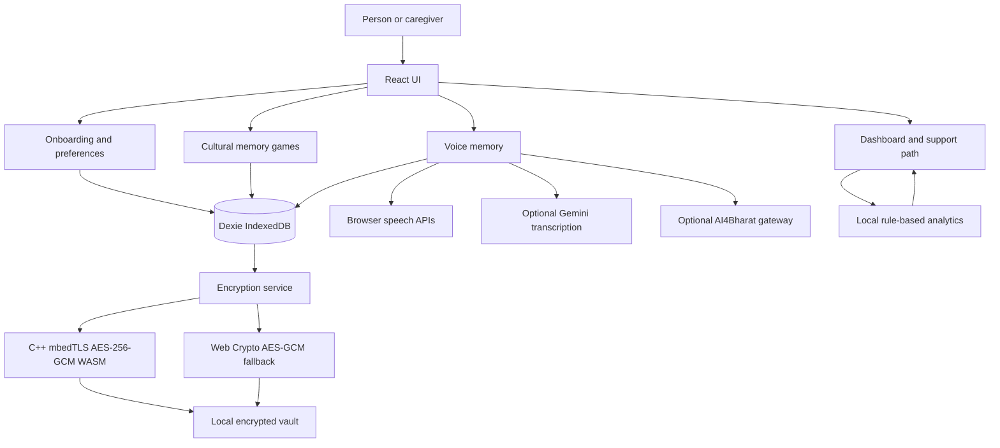

# CARE SIH 26003: Technical Explanation

## 1. Project Purpose

CARE is an offline-first Progressive Web App for culturally familiar dementia support activities. It is designed for the SIH 26003 concept and focuses on:

- Northeast India cultural memory games
- Caregiver-supported activities
- Regional-language voice input and read-aloud support
- Local encrypted storage
- Explainable, non-clinical support recommendations
- Use without a constant internet connection

CARE is a support and cognitive-stimulation prototype. It is **not a dementia diagnostic, treatment, or clinical scoring system**.

## 2. Current Technology Stack

| Technology | Where it is used | What it does | Problem it solves |
|---|---|---|---|
| React 19 | `src/` | Builds the interface from components and state | Keeps onboarding, dashboard, games, settings, and voice features maintainable |
| Vite | `vite.config.js`, `package.json` | Development server and production bundler | Fast local development and a small browser bundle |
| Tailwind CSS | `src/styles/` and JSX classes | Responsive visual styling | Large, high-contrast, elder-friendly layouts without a large UI framework |
| Vite PWA | `vite.config.js` | Generates manifest and service worker | Installs the app and caches the offline shell |
| Dexie + IndexedDB | `src/db/db.js` | Stores profiles, sessions, events, and voice notes locally | Offline persistence without requiring a remote database |
| Web Crypto API | `src/services/crypto.js` | Browser AES-GCM fallback | Keeps existing records readable when WASM is unavailable |
| C++ + mbedTLS | `cpp/vault_core.cpp` | AES-256-GCM encryption compiled to WASM | Reuses a native cryptographic implementation in the web vault |
| Emscripten | `scripts/build-wasm.sh` | Compiles C++ and mbedTLS to browser-compatible WASM | Connects the C++ vault to JavaScript |
| Gemini | `src/services/gemini.js` | Optional cloud speech transcription | Converts recorded audio into reviewable text |
| AI4Bharat gateway | `src/services/ai4bharat.js` | Optional regional-language transcription and translation adapter | Supports Assamese, Manipuri/Meitei, Bodo, Bengali, and Nepali through a self-hosted service |
| Browser Speech APIs | `src/components/VoiceMemory.jsx`, `src/services/speech.js` | Speech recognition and text-to-speech fallback | Allows voice interaction without a configured cloud service when the browser supports it |
| JavaScript decision tree | `src/services/analytics.js` | Produces local support-path recommendations | Provides explainable behavior without needing a trained clinical model |

The repository also contains the full `mbedtls/` source tree and its WASM build output. That library is used as a cryptographic dependency for the CARE vault, not as an application UI module.

## 3. High-Level Architecture



## 4. Application Flow

### Startup

1. `src/App.jsx` loads the local profile and initializes the crypto service.
2. The app tries to load `public/wasm/vault_core.js` and `vault_core.wasm`.
3. If the WASM module is unavailable, the crypto service uses Web Crypto AES-GCM.
4. The profile is decrypted from the local Dexie vault.
5. The user sees onboarding or the dashboard.

### Profile and preferences

`src/components/Onboarding.jsx` collects:

- Name and optional age
- Northeast home region
- Preferred regional language
- A familiar person
- Familiar life interests such as farming, food, craft, music, family, and work

These values personalize content. They must not be treated as medical evidence.

### Games

`src/games/data.js` is the game registry. `src/games/Game.jsx` is the shared game runner. This keeps all games consistent for:

- Four gentle rounds
- Large answer buttons
- Hints
- Companion mode
- Speech playback
- Completion feedback
- Local session logging
- Duration tracking

Current cultural activities include:

- People I know
- Our celebrations
- My daily routine
- Places I remember
- Everyday Skills
- Listen and remember
- Voices from home
- Festival treasures
- Market memories

The regional content is a starting point. It should be reviewed by speakers and community representatives before public deployment, especially for dialect spelling, pronunciation, cultural context, and local food or festival descriptions.

### Voice flow

The voice memory flow follows this order:

1. Use the AI4Bharat gateway when configured.
2. Fall back to Gemini when configured and AI4Bharat fails.
3. Fall back to browser speech recognition.
4. Let the user type the memory if voice is unavailable.
5. Show the transcript for review.
6. Encrypt the accepted text locally before saving it.

Read-aloud uses `src/services/speech.js` to select an exact regional voice, a matching language voice, an Indian English voice, or the browser default. Some Linux browser environments expose no installed voices. In that case CARE reports the limitation instead of silently failing.

AI4Bharat currently needs a trusted server or local inference service. The browser adapter expects:

```text
POST /transcribe
multipart form: file, language_code
response: { "transcript": "..." }

POST /translate
json: { "text": "...", "source_lang": "eng_Latn", "target_lang": "asm_Beng" }
response: { "translation": "..." }
```

For production, model credentials must stay on the gateway server. Do not ship them in the PWA.

## 5. Local Data and Encryption

Dexie creates the `care-local-vault` IndexedDB database with these logical stores:

- `vault`: encrypted profile
- `sessions`: completed game sessions and duration
- `events`: game starts, answers, hints, feedback, and voice-note events
- `settings`: local settings
- `voiceNotes`: encrypted memory notes

The current vault algorithm is:

- AES-256-GCM in C++ through mbedTLS and WASM
- AES-GCM through Web Crypto as fallback
- SHA-256 of a locally generated device secret to derive the AES key
- A 12-byte IV and 16-byte GCM authentication tag

The C++ vault uses browser `crypto.getRandomValues()` through an Emscripten bridge for IV generation. The browser fallback also uses `crypto.getRandomValues()`.

This is appropriate for an MVP demonstration, but the key lifecycle is not production-ready. The device secret is held in browser local storage. A production release should use a stronger key hierarchy, authenticated metadata, secure recovery, explicit device binding, and an independent security review.

## 6. Decision Tree and Support Recommendations

The local planner in `src/services/analytics.js` is intentionally rule-based and explainable. It uses:

- A minimum of four recent activities before describing a pattern
- Recent active days
- Self-reported difficulty and enjoyment
- Total minutes played
- Average session duration

Current rule order:

```text
IF fewer than four recent sessions
    -> build more data and keep the routine gentle
ELSE IF difficult feedback is greater than enjoyed feedback
    -> use a gentler game, hints, or caregiver support
ELSE IF average session duration is at least 25 minutes
    -> suggest shorter sessions and rest breaks
ELSE IF fewer than two active days
    -> invite a caregiver or trusted person to join
ELSE
    -> continue the familiar CARE routine
```

Play time is an **engagement signal**, not a memory score and not evidence of dementia. The app always explains the reason and next step. AI may later personalize the wording, but it must not override this local safety logic.

### Why not scikit-learn yet?

A scikit-learn decision tree is useful when there is a sufficiently large, representative, labelled, and clinically reviewed dataset. CARE currently has local activity data, not validated clinical labels. Training a model now would create a high risk of overfitting and unsafe claims.

For the SIH MVP, the best approach is:

1. Use explicit local rules.
2. Log consented, minimal engagement features.
3. Ask clinical and community reviewers to define safe outcomes.
4. Evaluate the rules with synthetic and usability test cases.
5. Only later train a shallow model if the dataset and governance are ready.

## 7. What Each Major Module Solves

### `src/App.jsx`

Controls application startup, profile loading, settings, games, and reset behavior.

### `src/components/Dashboard.jsx`

Provides the main activity surface, engagement summary, recommended next activity, and explainable CARE support path.

### `src/components/VoiceMemory.jsx`

Handles microphone recording, browser speech recognition, AI4Bharat/Gemini transcription, transcript review, encrypted note saving, and read-aloud.

### `src/games/Game.jsx` and `src/games/data.js`

Provide the shared game interaction model and culturally familiar content.

### `src/db/db.js`

Owns local persistence and normalizes legacy profiles that do not contain a profile ID. This avoids invalid Dexie queries and keeps existing local data usable.

### `src/services/crypto.js`

Selects the C++ WASM vault when available and preserves Web Crypto compatibility for older records or unsupported environments.

### `src/services/analytics.js`

Contains recommendation and support rules. It should remain deterministic and testable.

### `src/services/ai4bharat.js`

Keeps the PWA independent from a specific AI4Bharat deployment. It sends only the minimum audio or text needed by the configured gateway.

### `src/services/speech.js`

Centralizes regional voice labels, voice selection, and read-aloud error reporting.

### `cpp/vault_core.cpp`

Implements the C++ encryption ABI exported to JavaScript: `encrypt_json` and `decrypt_json`.

### `scripts/build-wasm.sh`

Builds the C++ vault using Emscripten and the mbedTLS WebAssembly library.

## 8. Current Challenges and How CARE Tackles Them

### Challenge: sensitive health-adjacent data

**Approach:** Store records locally, encrypt notes and profiles, minimize event payloads, require transcript review, and keep AI optional.

**Remaining work:** Add an explicit consent record for cloud transcription, data export, selective deletion, and a production key-management design.

### Challenge: no internet connection

**Approach:** React assets, service worker, IndexedDB, local analytics, and browser fallback keep the core activity flow offline.

**Remaining work:** Test offline behavior on real Android devices and verify service-worker update and rollback behavior.

### Challenge: regional languages and dialects

**Approach:** Store language preferences, use regional content, map language codes for AI4Bharat, and select matching browser voices when available.

**Remaining work:** Add a server-side AI4Bharat inference gateway, regional TTS, speaker review, dialect datasets, and pronunciation testing with communities from each target region.

### Challenge: browser speech inconsistency

**Approach:** Detect missing APIs, report permission and network errors, select available voices, and provide typing plus cloud transcription fallbacks.

**Remaining work:** Use a managed or self-hosted TTS service for consistent regional read-aloud instead of relying only on installed browser voices.

### Challenge: clinical safety

**Approach:** Avoid diagnosis language, use support signals, require minimum data, show uncertainty, and keep deterministic rules ahead of AI.

**Remaining work:** Obtain clinical review, define an approved caregiver check-in, define emergency guidance by deployment region, and conduct a formal safety and usability review.

### Challenge: small and unlabelled dataset

**Approach:** Use a shallow, explainable rule tree rather than a trained black-box model.

**Remaining work:** Establish a data-governance plan before collecting any dataset intended for model training.

### Challenge: user trust and accessibility

**Approach:** Large controls, comfort mode, hints, companion mode, culturally familiar content, transcript review, and no pass/fail language.

**Remaining work:** Add automated accessibility checks and testing with older adults, caregivers, low-literacy users, and regional-language speakers.

## 9. Recommended Technology Additions

### Priority 1: testing foundation

Add:

- Vitest for service and decision-tree tests
- React Testing Library for dashboard, onboarding, and voice states
- Playwright for browser smoke tests
- `npm run test`, `npm run test:watch`, and `npm run test:e2e` scripts

First tests should cover:

- Every support-tree branch
- Missing legacy profile ID
- Encryption round trip and wrong-secret failure
- WASM unavailable fallback
- Consent and transcript review
- Voice permission, no-speech, and unavailable-voice states
- Offline app startup

### Priority 2: server-side AI4Bharat gateway

Add a small FastAPI or Node service that:

- Keeps AI4Bharat model credentials server-side
- Exposes `/transcribe`, `/translate`, and later `/synthesize`
- Validates request size, file type, language code, and response schema
- Applies timeouts and rate limits
- Removes temporary audio after processing
- Logs operational metadata without raw health content
- Returns deterministic errors so the PWA can fall back locally

### Priority 3: schema validation and typed contracts

Add Zod on the TypeScript boundary or JSON Schema validation in the gateway for:

- AI4Bharat responses
- Support-plan objects
- Encrypted vault envelopes
- Profile and session records

This prevents malformed model output from reaching the UI.

### Priority 4: consent, export, and deletion controls

Add a privacy screen that records:

- Whether the person or caregiver consented
- Which services may receive audio
- Language and purpose
- Consent timestamp and version

Add encrypted export and selective deletion for profiles, notes, sessions, and cloud-processing history.

### Priority 5: production key management

Replace the local-storage-only secret design with:

- A device-bound key derived through a platform keystore where available
- A user recovery path that does not store a raw master secret in the browser
- Key rotation and vault-envelope versioning
- Secure wipe and logout behavior
- Independent cryptographic review

### Priority 6: regional TTS and content review

Add `/synthesize` to the AI4Bharat gateway or another approved Indic speech service. Maintain a content catalog with:

- Source language and script
- Transliteration
- Reviewed translation
- Pronunciation notes
- Community reviewer and version

### Priority 7: observability without health-data leakage

Add error monitoring for crashes and gateway failures, but never send raw memories, transcripts, answers, or clinical-adjacent content to analytics by default. Prefer aggregate operational counters and local diagnostic export.

## 10. Suggested MVP Roadmap

### Demo-ready now

- Offline PWA shell
- Cultural games
- Local activity and duration tracking
- Explainable support tree
- AES-GCM local vault
- AI4Bharat gateway adapter
- Gemini and browser speech fallbacks
- Regional language preferences

### Next implementation slice

1. Add Vitest and Playwright.
2. Add unit tests for the support tree and crypto service.
3. Build the AI4Bharat FastAPI gateway with `/transcribe` and `/translate`.
4. Add consent and cloud-processing status to VoiceMemory.
5. Add `/synthesize` for consistent regional read-aloud.
6. Test with real Northeast language speakers and caregivers.

### Before public or clinical deployment

- Clinical and community review
- Privacy threat model
- Security review of key management and WASM boundary
- Consent and retention policy
- Accessibility testing with target users
- Offline and low-bandwidth field testing
- Model quality evaluation by language and dialect
- Clear local emergency and clinician referral guidance

## 11. Useful Commands

```bash
npm install
npm run dev
npm run build
npm run preview

# Rebuild the C++ vault after activating Emscripten
source "$HOME/emsdk/emsdk_env.sh"
./scripts/build-wasm.sh
```

## 12. Bottom Line

CARE already has a strong SIH MVP foundation: offline storage, local encryption, culturally familiar activities, regional-language integration points, and explainable recommendations. The next high-value addition is not a larger AI model. It is a tested server-side language gateway, consistent regional TTS, consent controls, and a clinical/community review process around the support rules.
